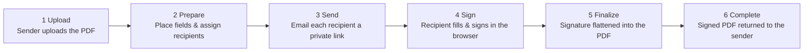
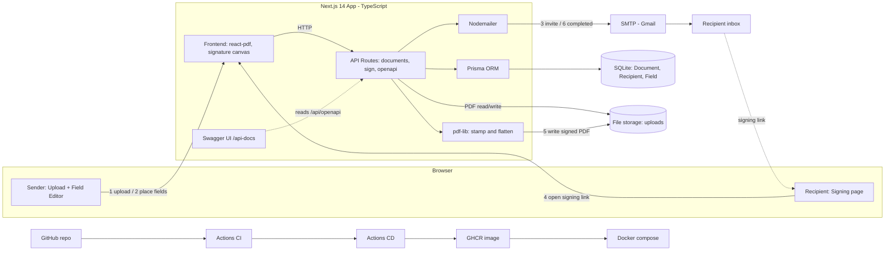

# CORE Cashless e-Sign

A DocuSign-style e-signature web app, themed to CORE Cashless: upload a PDF,
drag-drop signature/text/checkbox/date/radio fields onto it, assign them to
recipients, email each recipient a signing link, let them fill and sign in the
browser, and email the sender the completed, stamped PDF.

> **Non-goal (per the brief): no digital certificates / cryptography.** This is a
> simple e-signature — the drawn signature image and field values are *stamped
> (flattened)* into the PDF with pdf-lib. No AcroForm, no PKI, no certificate of
> completion.

---

## Architecture

**The signing workflow (what happens, end to end):**



**System architecture (technical):**



> Editable source (two pages — technical map + business flow):
> [`docs/architecture.drawio`](docs/architecture.drawio) — open in [draw.io](https://www.drawio.com/) (desktop app or **File → Open**).

---

## Features → assignment requirements

| Requirement                         | How it's implemented                                                       |
| ----------------------------------- | -------------------------------------------------------------------------- |
| **PDF upload (drag-drop)**          | Home page upload zone (`react-dropzone`) → `POST /api/documents`           |
| **Drag-drop field placement**       | Editor: click-to-place, native-mouse move/resize on an overlay layer       |
| **Signature field**                 | Drawn on a canvas (`react-signature-canvas`) → PNG stamped via pdf-lib     |
| **Checkbox field**                  | Checkbox input on the signing page → "X" stamped in the box                |
| **Information / Text field**        | Text input → text stamped                                                  |
| **Date field**                      | Date value stamped; can be auto-filled with today's date                   |
| **Radio field (bonus)**             | Fields sharing a `groupName` form one group; selected option stamped       |
| **Auto-fill & auto-place**          | Fields can auto-resolve `NAME` / `EMAIL` / `DATE`, resolved server-side    |
| **Recipients + assignment**         | Each placed field is assigned to a recipient; tokens are per-recipient     |
| **Email workflow**                  | `src/lib/email.ts` (Nodemailer / SMTP, with Ethereal fallback)             |
| **In-browser signing**             | `/sign/[token]` renders only that recipient's fields as interactive inputs |
| **Return to sender**                | On completion the sender is emailed a link to download the signed PDF      |
| **No digital certificates**         | Explicit non-goal — simple flattened e-signature only                      |

---

## Tech stack

- **Next.js 14** (App Router) + **TypeScript**
- **Prisma** + **SQLite** (`prisma/dev.db`)
- **react-pdf 9.1.0** + **pdfjs-dist 4.4.168** for in-browser PDF rendering
  (pinned, compatible pair; the pdf.js worker is served as a static asset)
- **pdf-lib** for stamping / flattening field values into the PDF
- **Nodemailer** for email (real SMTP, or automatic Ethereal preview fallback)
- **Tailwind CSS** for styling
- `react-dropzone` (upload) and `react-signature-canvas` (signature capture)

react-pdf is rendered **client-only**: components that import it are loaded via
`next/dynamic(..., { ssr: false })`, so they never run during SSR. The pdf.js
worker is copied to `public/pdf.worker.min.mjs` by the `postinstall` script.

---

## Architecture notes

- **Coordinate mapping.** Field geometry is stored as **normalized top-left
  fractions** of the page (`xFrac, yFrac` = top-left corner; `wFrac, hFrac` =
  size), independent of display scale. At stamp time these are converted to
  pdf-lib's **bottom-left origin** in PDF points, for a page of size `W × H`:

  ```
  x          = xFrac * W
  drawWidth  = wFrac * W
  drawHeight = hFrac * H
  y          = H - (yFrac * H) - drawHeight   // top-left -> bottom-left
  ```

- **Flattened output.** Values are drawn directly onto the page content — the
  signed PDF has no editable form fields.
- **Per-recipient signing tokens.** Each recipient gets a unique, unguessable
  token; the signing page shows only that recipient's fields.
- **Auto-fill is authoritative server-side.** `NAME` / `EMAIL` / `DATE` fields
  are resolved on the server from the recipient record and the current date;
  client-submitted values for them are ignored.
- **Signed only after stamping succeeds.** A recipient is marked `SIGNED` only
  *after* their values are stamped into the PDF, so a stamping failure can't
  leave a recipient "signed" against an unstamped document. When the last
  recipient signs, a clean final PDF is rebuilt from the original with all
  values, the document becomes `COMPLETED`, and the sender is notified.

---

## Getting started

```bash
npm install            # also runs prisma generate + copies the pdf.js worker
npx prisma db push     # creates prisma/dev.db from prisma/schema.prisma
npm run dev            # http://localhost:3000
```

A `.env` with sensible defaults (`DATABASE_URL`, `APP_URL`) is included so the
app runs out of the box.

### Email configuration (optional)

Create a `.env` (copy `.env.example`) to send real email:

| Variable    | Purpose                                                                   |
| ----------- | ------------------------------------------------------------------------- |
| `SMTP_HOST` | SMTP host (e.g. `smtp.gmail.com`)                                         |
| `SMTP_PORT` | SMTP port (e.g. `587`)                                                    |
| `SMTP_USER` | SMTP username (e.g. your Gmail address)                                   |
| `SMTP_PASS` | SMTP password / API key                                                   |
| `MAIL_FROM` | From address (must be a verified / allowed sender)                        |
| `APP_URL`   | Base URL used to build signing/download links (default `http://localhost:3000`) |

**Without SMTP configured**, the app creates a Nodemailer **Ethereal** test
account at runtime and prints a **preview URL** to the server console for every
email — so the full flow is demoable with zero credentials. Watch the terminal:

```
[email] Sent "Please sign: ..." to alice@example.com. Preview: https://ethereal.email/message/...
```

**Using Gmail:** the `SMTP_PASS` value must be a Gmail **App Password** (16-char,
created under your Google Account → Security → App passwords), **not** your normal
account password. For a take-home, **revoke that App Password afterward.**

---

## Test the whole flow

A sample PDF is included at **`samples/CORE-Cashless-Service-Agreement.pdf`** —
upload it on the home page.

1. Home page: enter your (sender) email and **drag-drop the PDF**. You're
   redirected to the editor.
2. **Editor** (`/documents/[id]/edit`): add a recipient, pick a field type
   (Signature / Text / Checkbox / Date / Radio), and **click the page** to drop
   it. Drag to move, drag the corner handle to resize, click **×** to delete.
   Then **Save fields** → **Save & Send for signature**.
3. **Sign** (`/sign/[token]`): open the link from the email (or Ethereal
   preview). Only that recipient's fields are interactive. Fill them and
   **Sign & Submit**.
4. On the last recipient's submission the doc becomes `COMPLETED` and the sender
   is emailed a download link.
5. **Download** the signed PDF from the home page or `/api/documents/[id]/download`.

To reset signing state and re-test, run:

```bash
node scripts/reset-signing.mjs
```

---

## Docker

```bash
docker compose up --build
```

The container runs `npm ci` (which triggers `prisma generate` + the worker
copy), `prisma db push`, and `next build`; on start it runs `prisma db push`
again (idempotent) and `npm start`. Named volumes persist `prisma/dev.db` and
the `uploads/` directory across restarts. Supply email settings via `.env`
(read through `env_file`). The app is served at `http://localhost:3000`.

---

## API docs

Interactive Swagger UI is available at **`/api-docs`** (also linked from the
footer). It's rendered from the OpenAPI 3.0 spec served by
**`GET /api/openapi`**.

### API routes

| Method & path                          | Purpose                                                          |
| -------------------------------------- | --------------------------------------------------------------- |
| `POST /api/documents`                  | Multipart upload (`file` + optional `senderEmail`); create DRAFT |
| `GET /api/documents`                   | List documents                                                  |
| `GET /api/documents/[id]`              | Document + fields + recipients                                  |
| `PUT /api/documents/[id]/fields`       | Replace fields, upsert recipients (`{ recipients[], fields[] }`) |
| `POST /api/documents/[id]/send`        | Create/keep tokens, email links, set `SENT`                     |
| `GET /api/documents/[id]/file`         | Stream original PDF (token-scoped if `?token=`)                  |
| `GET /api/documents/[id]/download`     | Stream signed PDF (falls back to original)                       |
| `GET /api/sign/[token]`                | Recipient + document + that recipient's fields                  |
| `POST /api/sign/[token]`               | Submit `{ values }`, mark SIGNED, stamp; complete + notify sender |

---

## CI / CD

**CI** — `.github/workflows/ci.yml` runs on push / PR to `main` (Ubuntu, Node 20):
`npm ci` → `npx prisma generate` → `npx tsc --noEmit` → `npm run build`.

**CD** — `.github/workflows/cd.yml` runs on push to `main`: it builds the Docker
image and **publishes it to GitHub Container Registry (GHCR)** using the built-in
token (no secrets / external accounts). Pull and run the published artifact:

```bash
docker run -p 3000:3000 --env-file .env ghcr.io/farahfarchoukh/esign-mvp:latest
```

**Live deployment (further step).** To put it on a public URL, deploy the image to
a **disk-backed host (Render / Railway / Fly.io)** with a persistent volume — SQLite
+ uploaded/signed PDFs survive as-is, no data-layer changes; just set the SMTP env.
A **serverless host (Vercel)** would first need the data-layer swaps in *Production
notes* below (Postgres + object storage), since its filesystem is ephemeral.

---

## Data model (Prisma)

- **Document** — `id, title, originalPath, signedPath?, status (DRAFT|SENT|COMPLETED), senderEmail, timestamps`
- **Recipient** — `id, documentId, name, email, signingToken (unique), status (PENDING|SIGNED), signedAt?`
- **Field** — `id, documentId, recipientId?, type (SIGNATURE|CHECKBOX|TEXT|DATE|RADIO), page, xFrac, yFrac, wFrac, hFrac, value?, required, groupName?, optionLabel?, autoFill?`

SQLite has no enums, so status/type/autoFill are strings with the documented
allowed values.

---

## Production notes

This project intentionally uses **SQLite** and **local-file PDF storage** —
ideal for a local take-home, but they **won't survive a serverless / ephemeral
host** (the filesystem and DB are not persistent or shared across instances).
For a real deployment:

- Swap **SQLite → Postgres** (change the Prisma datasource + `DATABASE_URL`).
- Swap **local files → object storage** (e.g. S3) for uploaded and signed PDFs.
- Add **authentication** — currently anyone with a document id can view/download,
  and anyone with a signing token can sign (the `?token=` guard is basic scoping,
  not real auth).

These are deliberate scope choices for the take-home.
